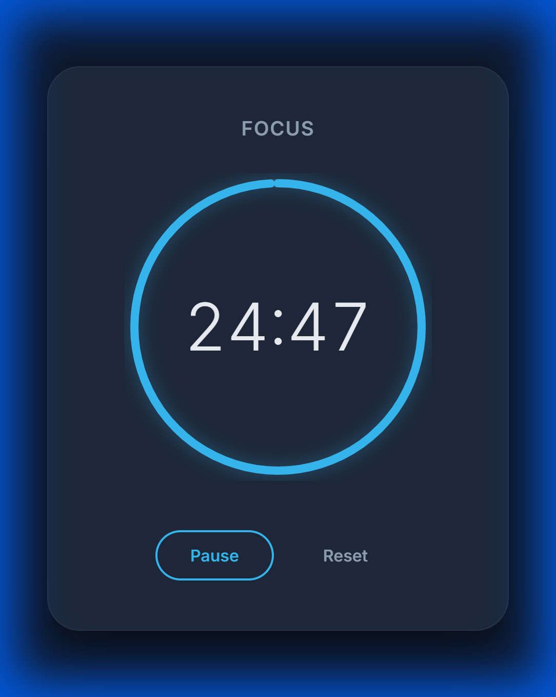
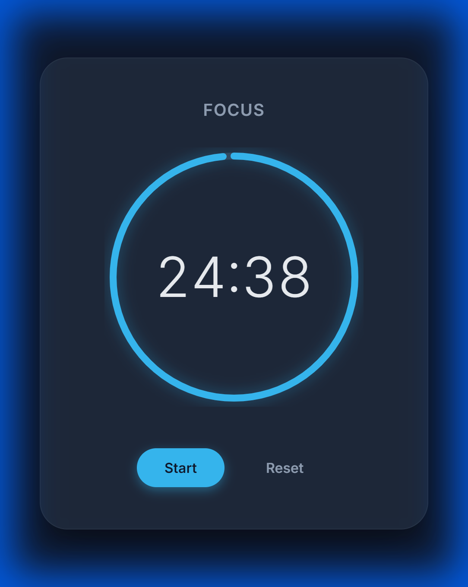
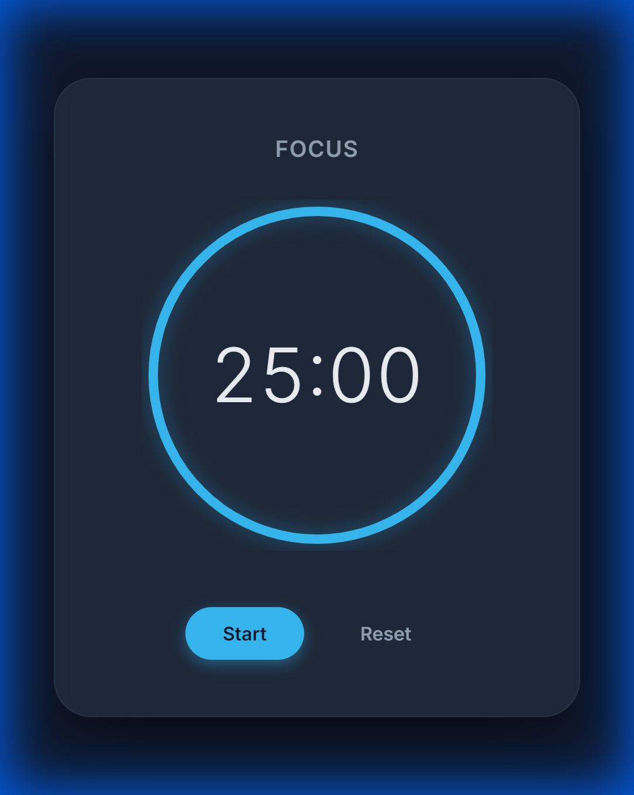
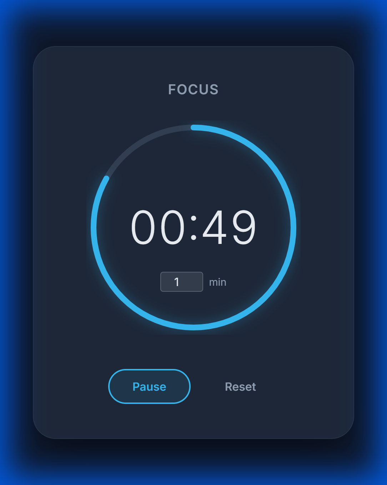
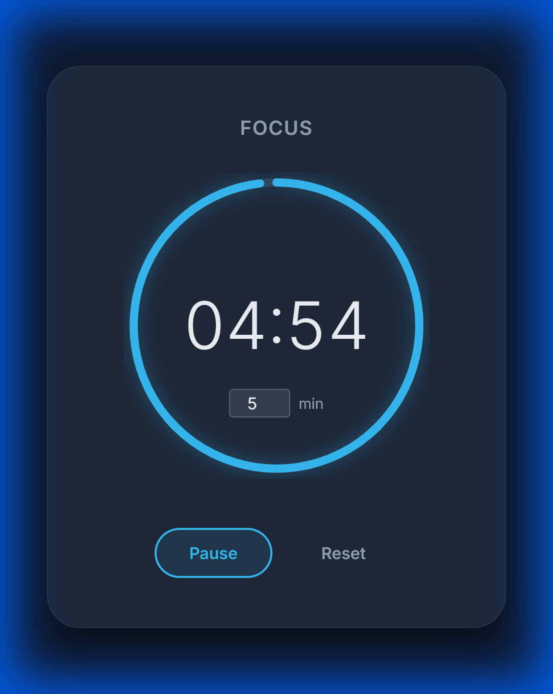

# Pomodoro Timer - Walkthrough

## Overview
A clear, premium-designed Pomodoro timer web application to help with focus sessions. Built with HTML, CSS (clean dark mode), and Vanilla JavaScript.

## Features
- **25-minute Timer**: Defaults to the standard Pomodoro interval.
- **Visual Progress Ring**: An SVG-based ring that smoothly depletes as time counts down.
- **Controls**:
  - **Start**: Begins the countdown.
  - **Pause**: Halts the timer (swaps with Start button).
  - **Reset**: Stops the timer and resets to 25:00.
- **Premium UI**: Deep blue/slate color palette with neon accents and glassmorphism effects.

## File Structure
- `index.html`: Structure and SVG elements.
- `style.css`: Styling, animations, and responsive layout.
- `script.js`: Timer logic, event handling, and progress calculation.

## Usage
1. Open `index.html` in any modern web browser.
2. Click **Start** to begin your focus session.
3. The ring will animate counter-clockwise as time passes.
4. When finished or interrupted, use **Pause** or **Reset**.

## Verification
Verification was confirmed manually and recorded. The application loads correctly, styles are applied, and the timer logic functions as expected.

### Video Demonstration

### State Screenshots

<!-- slide -->

<!-- slide -->

<!-- slide -->

<!-- slide -->

